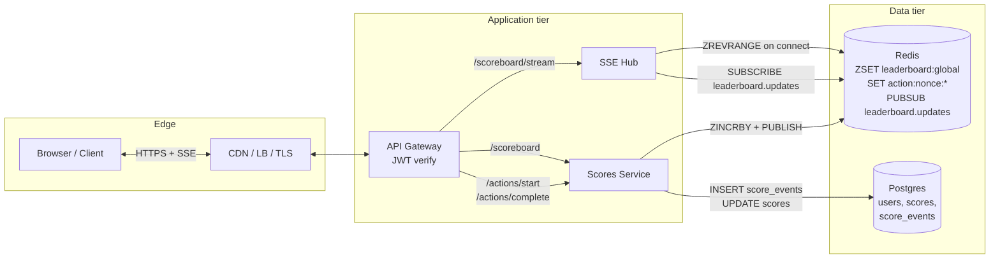
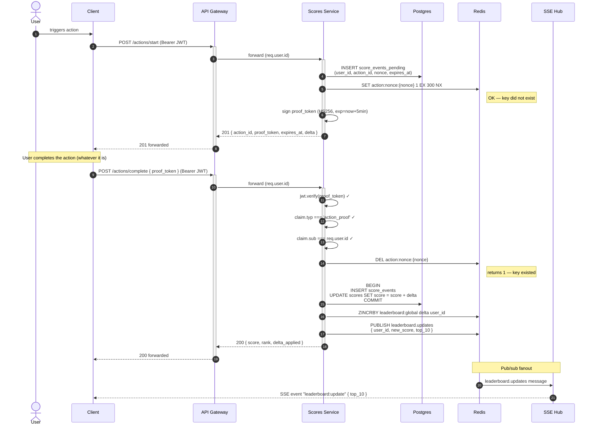
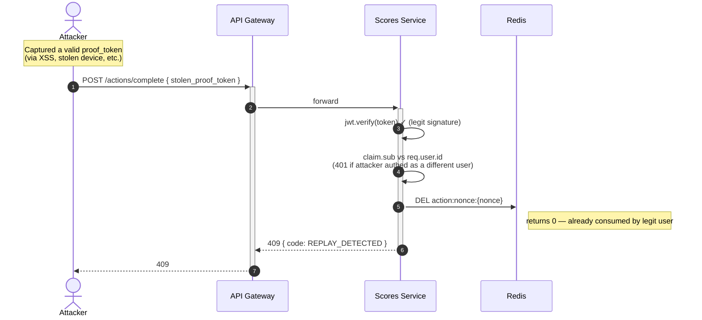
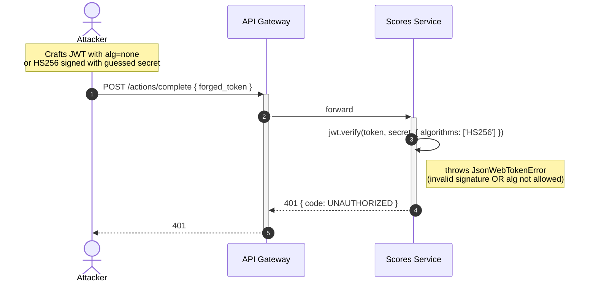
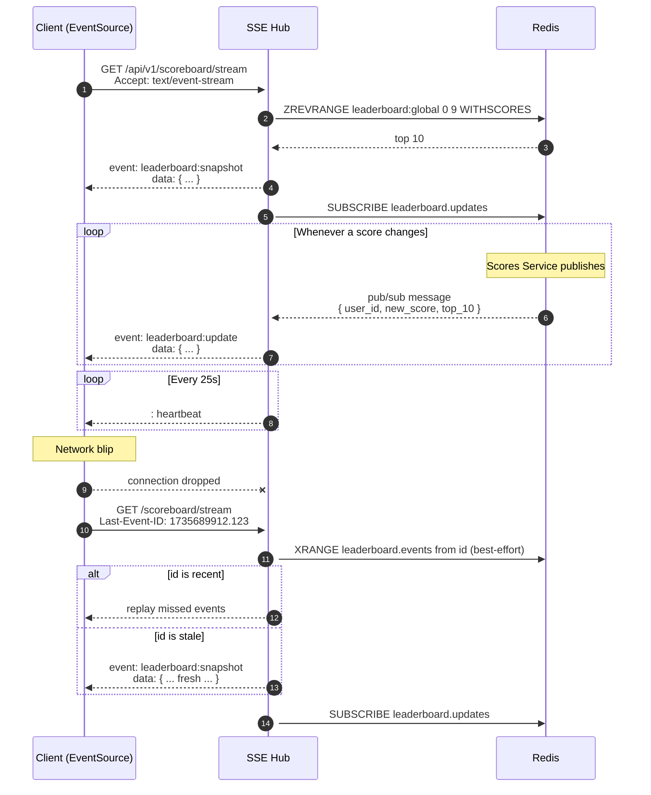
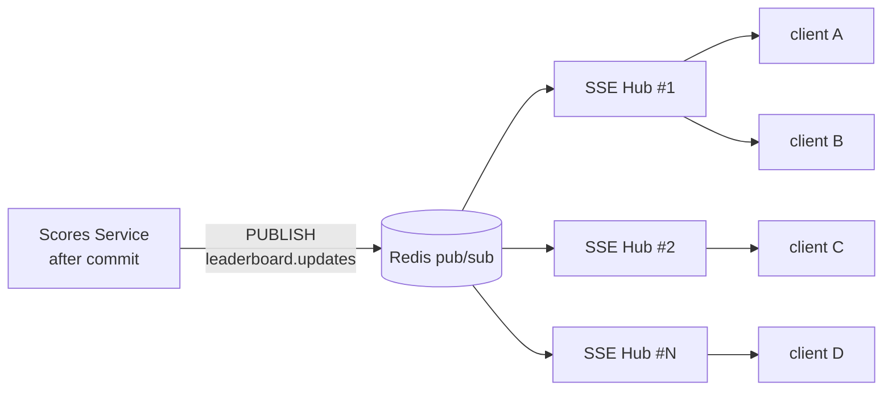

# Live Scoreboard Module — Architecture Specification

> Spec for **Problem 6** of the 99Tech Code Challenge.
>
> Audience: a backend engineering team that will implement this module against an existing API service. The implementer can read this top-to-bottom and start coding without further questions on the load-bearing decisions; remaining product alignment items are listed in [§13](#13-open-questions).

---

## TL;DR

Build a **server-mediated, replay-safe score-update protocol** with **SSE-based live leaderboard fanout**:

- Two-phase action lifecycle: `POST /actions/start` issues a **short-lived signed proof token** (HS256, 5-minute exp, nonce-bound). The user does whatever the action is. `POST /actions/complete` validates the proof, atomically increments the score, and broadcasts.
- **Replay protection**: every proof carries a one-shot nonce stored in Redis with a 5-minute TTL. Reuse → `409 REPLAY_DETECTED`.
- **Storage**: Postgres is the source of truth (`scores`, `score_events`); Redis sorted set `leaderboard:global` is the hot leaderboard cache.
- **Live updates**: `GET /scoreboard/stream` is a Server-Sent Events endpoint subscribed to Redis pub/sub `leaderboard.updates`. Polling fallback at `GET /scoreboard`.
- **Audit trail**: every score change is one row in `score_events`. Rollback is a deterministic replay.

The load-bearing decisions are flagged 🎯.

---

## Table of contents

1. [Context](#1-context)
2. [Goals & non-goals](#2-goals--non-goals)
3. [High-level architecture](#3-high-level-architecture)
4. [Action lifecycle & threat model](#4-action-lifecycle--threat-model)
5. [API contract](#5-api-contract)
6. [Data model](#6-data-model)
7. [Live-update mechanism](#7-live-update-mechanism)
8. [Security model](#8-security-model)
9. [Concurrency & failure modes](#9-concurrency--failure-modes)
10. [Operational concerns](#10-operational-concerns)
11. [Implementation notes](#11-implementation-notes)
12. [Improvements](#12-improvements)
13. [Open questions](#13-open-questions)
14. [Glossary](#14-glossary)
15. [Todo / tickets](#15-todo--tickets)

---

## 1. Context

### Problem statement (verbatim)

> We have a website with a score board, which shows the top 10 user's scores. We want live update of the score board. User can do an action (which we do not need to care what the action is), completing this action will increase the user's score. Upon completion the action will dispatch an API call to the application server to update the score. We want to prevent malicious users from increasing scores without authorisation.

### 🎯 Why this problem is non-trivial

A naive design — `POST /scores/increment` with a JWT, server adds 1 to the caller's score — looks correct and fails immediately. An authenticated user can call the endpoint 10,000 times via curl and reach the top of the leaderboard.

The authentication question ("is this a real user?") doesn't help. The missing question is: **"did the action that justifies this increment actually happen?"** The server must be the source of truth for the action lifecycle, not just the recipient of a "trust me, I did it" message.

This spec makes the action lifecycle server-mediated and provides a cryptographic proof that the lifecycle went through the canonical state machine. Combined with replay protection and per-user rate limiting, score increments become **unforgeable, single-use, and auditable**.

### Why a leaderboard problem matters

Leaderboards are viral mechanics — users compare scores socially, which both drives engagement and amplifies the impact of cheating. A hacked leaderboard is a brand-reputation incident on day one. Investing in a tight protocol now is much cheaper than retrofitting it after a public exploit.

### Audience and prerequisites

This document is for backend engineers implementing the module. It assumes:

- An existing user authentication system that issues JWTs (HS256). New components reuse the same secret/issuer.
- An existing API gateway or Express-style service mesh where new endpoints can be mounted.
- **Postgres 13+** available as primary storage.
- **Redis 6+** available with persistence (RDB or AOF) and pub/sub enabled.
- A standard observability stack (Prometheus or equivalent metrics scraping + a structured-logging pipeline).

The spec does *not* assume a specific frontend framework, a specific CDN, or a specific deployment target.

---

## 2. Goals & non-goals

### Goals

- **G1 — Auth-only score writes.** Every increment is tied to an authenticated user; unauthenticated writes are impossible.
- **G2 — Action-bound score writes.** Every increment is tied to an action lifecycle that the server has observed start to finish. No "loose" increments.
- **G3 — Replay-resistant.** A captured `complete` request cannot be replayed for additional credit.
- **G4 — Live leaderboard.** Connected clients see the top-10 update within ≤ 1 second of any score change, under normal load.
- **G5 — Auditable.** Every score change is a durable, queryable row with `(user_id, action_id, delta, source_ip, created_at)`.
- **G6 — Observable.** Operators can answer "is the system healthy?" and "is the system being abused?" from dashboards alone.
- **G7 — Recoverable.** Any leaderboard divergence between cache (Redis) and source of truth (Postgres) is reconstructable from `score_events` alone.

### Non-goals

- **N1 — Multi-leaderboard support.** One global top-10 only. Friends-only / regional / time-windowed leaderboards are listed under [§12 Improvements](#12-improvements) but out of scope here.
- **N2 — Multi-region / multi-DC.** Single-region deployment; cross-region replication is a separate spec.
- **N3 — Real-time bidirectional protocol.** Clients receive updates; they do not push score-related state over the same channel. SSE is sufficient. WebSockets are over-engineered for this use case.
- **N4 — Defining the action.** The spec is action-agnostic; whether the action is "complete a quest" or "watch an ad" is a product decision. The protocol works the same way for any action whose completion can be confirmed by the server.
- **N5 — Identity / authentication system.** This module assumes JWT-based auth already exists. Integrating an OAuth2 provider or building a registration flow is out of scope.
- **N6 — Anti-bot CAPTCHA.** Bot mitigation at the action-start step is a separate concern (handled at the gateway / WAF layer if needed).
- **N7 — Score adjudication / leaderboard reset.** Periodic resets, manual score adjustments, or score forfeiture are admin-tool concerns, not in this spec.

---

## 3. High-level architecture

### Components



| Component | Responsibility | Stateless? | Scaling unit |
|---|---|---|---|
| **API Gateway** | TLS termination, routing, JWT verification, rate limit | yes | horizontal |
| **Scores Service** | Action lifecycle, score increments, audit log writes | yes | horizontal |
| **SSE Hub** | Maintains long-lived SSE connections; fans out leaderboard updates from Redis pub/sub | yes (state in Redis) | horizontal |
| **Postgres** | Source of truth: `users`, `scores`, `score_events` | n/a | vertical + read replicas |
| **Redis** | Hot leaderboard (sorted set), action nonces, pub/sub channel | n/a | Sentinel or Cluster |

The gateway and both services are stateless — every long-lived connection state lives in Redis or Postgres. Horizontal scaling is "add more replicas behind the load balancer".

### One-paragraph happy path

A logged-in user clicks "do action". Their browser calls `POST /actions/start`; the Scores Service records a pending action, mints a 5-minute proof token (HS256, contains `user_id`, `action_id`, `nonce`, `exp`, `delta`), and returns it. The user completes whatever the action involves. The browser calls `POST /actions/complete` with the proof token. The Scores Service verifies the signature, atomically marks the nonce consumed in Redis (rejects duplicates), commits the score increment to Postgres, updates the Redis sorted set, and publishes a `leaderboard.updates` message. Every connected SSE Hub instance receives the pub/sub message and pushes a `leaderboard:update` event to its connected clients. The leaderboard widget in every browser updates in well under a second.

---

## 4. Action lifecycle & threat model

### 🎯 The core design decision

The spec turns score-update authority **inside out**. Rather than the client telling the server "I did the thing, give me +N", the server issues a **proof of authorisation** that ties a specific user to a specific action with a short-lived, single-use token. The client's role is reduced to (a) starting an action, (b) completing whatever the action is, (c) returning the proof to the server. Without the proof, no credit is granted.

### State machine

```
            +-------------+
   start    |             |   complete (valid proof)
 ---------> |   PENDING   | -------------------------> CONSUMED
            |             |
            +-------------+
                 |
                 |  TTL (5 min)
                 v
              EXPIRED   (proof rejected with 410)
```

| State | Stored where | TTL | Transitions in | Transitions out |
|---|---|---|---|---|
| **PENDING** | Postgres `score_events_pending` row + Redis nonce key | 5 min (Redis); row stays for audit | from `/actions/start` | → CONSUMED on valid `/actions/complete`; → EXPIRED on TTL |
| **CONSUMED** | Postgres `score_events` row, Redis nonce deleted | n/a | from `/actions/complete` | terminal |
| **EXPIRED** | Postgres `score_events_pending` row tagged expired (background job) | n/a | from PENDING after TTL | terminal |

### Proof token shape

A standard JWT, signed HS256 with the same secret as user-auth tokens but **scoped distinctly via the `typ` claim**:

```json
{
  "iss": "scoreboard",
  "aud": "scoreboard",
  "typ": "action_proof",
  "sub": "user_id_uuid",
  "act": "action_id_uuid",
  "nonce": "32-byte-random-base64url",
  "iat": 1735689600,
  "exp": 1735689900,
  "delta": 1
}
```

Required claims:

- `iss` / `aud` distinguish action-proof tokens from user-auth tokens at the issuer/audience level.
- `typ === "action_proof"` — verifying handlers MUST refuse cross-purpose use (e.g. a user-auth JWT replayed as a proof).
- `sub` binds the proof to the user the action was started for.
- `act` is the action lifecycle row ID in Postgres.
- `nonce` is the Redis key used for replay protection. Independent from `act` so even token-engineering attacks (forging an `act` that matches a real row) still fail at the nonce check.
- `delta` is the score increment the proof authorises. Server-issued — clients cannot change it.

Verification at `/actions/complete`:

1. `jwt.verify(token, JWT_SECRET, { algorithms: ['HS256'], issuer: 'scoreboard', audience: 'scoreboard' })` — fails closed on alg-confusion, expiry, signature, issuer, audience.
2. `claim.typ === 'action_proof'` — fails closed on cross-purpose tokens.
3. `claim.sub === req.user.id` — caller must be the user the proof was issued to.
4. `Redis DEL action:nonce:<nonce>` — must return `1`. If `0`, the nonce was either never set (forgery), already consumed (replay), or expired (TTL).
5. Apply `claim.delta` server-side. Any client-supplied delta in the request body is ignored.

### Sequence diagram — happy path



### Sequence diagram — replay attempt rejected



### Sequence diagram — forged token rejected



### Why this is sufficient

| Attack | Mitigation |
|---|---|
| Direct increment without an action | No endpoint exists; `/actions/complete` requires a proof token |
| Forging a proof token | HS256 signing with secret unknown to the client; `algorithms: ['HS256']` allowlist on verify |
| Replaying a proof token | Single-use Redis nonce; second use returns `0` from DEL |
| Stealing another user's token | `claim.sub === req.user.id` rejects cross-user use |
| Stretching the action lifecycle | 5-minute proof TTL; `/actions/start` rate-limited per user |
| Bypassing the start step | No way to mint a proof without `/actions/start`; gateway-level rate limit caps frequency |
| Reading proof tokens from client storage | Out of scope (general client-side security); short TTL limits blast radius |

### 🎯 Why this is not bulletproof — and the honest scope statement

This protocol assumes a **non-adversarial action body**. If the action is "watch a 10-second ad" and the client machine is fully under attacker control, nothing stops the attacker from automating the start→delay→complete sequence at the maximum legal rate (one action every 10 s plus rate-limit headroom). Defending against that needs either:

- **Server-side action verification** — for actions with a deterministic outcome the server can confirm (e.g. quiz answers, chess moves), the server validates the work, not just the lifecycle.
- **Client integrity attestation** — Apple App Attest, Play Integrity API, etc. — for native apps.
- **Behavioural anomaly detection** — score-velocity baselining per user, alarming on outliers.

These belong in [§12 Improvements](#12-improvements). The protocol in this spec **closes the entire class of "forge or replay a single increment"** attacks, which is the load-bearing security ask in the brief. Closing the orthogonal class of "automate legitimate-looking actions" is a product-shaped problem dependent on what the action actually is — out of scope for an action-agnostic spec.

---

## 5. API contract

All endpoints under `/api/v1/`. JSON request/response. UTF-8. Standard error shape:

```json
{ "error": { "code": "...", "message": "...", "details": {} } }
```

### HTTP status codes used

| Code | When |
|---|---|
| 200 | Success |
| 201 | Created (action lifecycle started) |
| 400 | Validation error (bad body / query) |
| 401 | Authentication required or failed |
| 404 | Resource not found |
| 409 | Conflict (replay, double-spend) |
| 410 | Gone (proof expired) |
| 429 | Rate-limited |
| 500 | Internal server error (don't leak details) |
| 503 | Dependent system (Redis / Postgres) unavailable |

### `POST /api/v1/actions/start`

Begin an action lifecycle. Server records a pending action and returns a single-use proof token.

| | |
|---|---|
| **Auth** | Bearer JWT (user-auth) |
| **Rate limit** | Per user: 60/min; per IP: 600/min (configurable) |
| **Idempotent?** | No. Each call mints a new lifecycle. See [§12.5](#125-idempotency-keys-on-actionsstart) for an `Idempotency-Key` extension. |

**Request body** (Zod schema):

```ts
z.object({
  action_type: z.enum(['quest', 'ad_view', 'puzzle' /* ... */]),
  client_metadata: z
    .object({
      referrer: z.string().url().optional(),
      client_version: z.string().max(32).optional(),
    })
    .optional(),
});
```

**201 response**:

```json
{
  "action_id": "11111111-1111-1111-1111-111111111111",
  "proof_token": "eyJhbGciOiJIUzI1NiIs...",
  "expires_at": "2026-05-05T12:34:56.789Z",
  "delta": 1
}
```

**Errors**:

| Code | Condition |
|---|---|
| 400 `VALIDATION_ERROR` | Body shape wrong / unknown `action_type` |
| 401 `UNAUTHORIZED` | Missing or invalid JWT |
| 429 `RATE_LIMITED` | Per-user or per-IP cap exceeded |
| 503 `LIVE_BACKEND_UNAVAILABLE` | Redis or Postgres unreachable |

### `POST /api/v1/actions/complete`

Submit a proof token to credit the action's score delta.

| | |
|---|---|
| **Auth** | Bearer JWT (user-auth) AND proof_token in body |
| **Rate limit** | Inherits from `/actions/start`'s per-user cap |
| **Idempotent?** | Yes — by construction (replay → 409). Safe to retry on transport failure. |

**Request body**:

```ts
z.object({ proof_token: z.string().min(1) });
```

**200 response**:

```json
{ "score": 47, "rank": 3, "delta_applied": 1 }
```

**Errors**:

| Code | Condition |
|---|---|
| 400 `VALIDATION_ERROR` | Body shape wrong |
| 401 `UNAUTHORIZED` | JWT or proof signature invalid; or `claim.sub !== req.user.id` |
| 409 `REPLAY_DETECTED` | Nonce already consumed |
| 410 `PROOF_EXPIRED` | Token TTL elapsed (separate from replay so the client can retry-with-fresh-start) |
| 503 `LIVE_BACKEND_UNAVAILABLE` | Redis or Postgres unreachable |

### `GET /api/v1/scoreboard`

Return the current top-10. The HTTP path; the SSE path is below.

| | |
|---|---|
| **Auth** | Optional. If authenticated, response includes the caller's own rank/score; if not, only the leaderboard. |
| **Rate limit** | Per IP: 600/min |
| **Idempotent?** | Yes — pure read. Cacheable for 1 second at the CDN. |

**Query params**: none.

**200 response**:

```json
{
  "leaderboard": [
    { "rank": 1, "user_id": "...", "username": "alice", "score": 1840 },
    { "rank": 2, "user_id": "...", "username": "bob",   "score": 1715 }
  ],
  "your_rank": 47,
  "your_score": 23,
  "fetched_at": "2026-05-05T12:34:56.789Z"
}
```

`your_rank` and `your_score` are omitted for unauthenticated callers.

### `GET /api/v1/scoreboard/stream`

Server-Sent Events stream of leaderboard updates.

| | |
|---|---|
| **Auth** | Optional |
| **Connection** | `Accept: text/event-stream`; long-lived; HTTP/1.1 keep-alive |
| **Rate limit** | Per IP: 5 concurrent connections; per user: 10 |

**Initial event** (always emitted on connect):

```
event: leaderboard:snapshot
data: { "leaderboard": [...], "fetched_at": "..." }

```

**Update events** (one per `leaderboard.updates` pub/sub message):

```
event: leaderboard:update
id: 1735689912.123
data: { "leaderboard": [...], "changed_user_id": "..." }

```

**Heartbeat** (every 25 s; prevents idle proxies from reaping the connection):

```
: heartbeat 1735689945

```

**Reconnect**: Browsers' `EventSource` reconnects automatically with `Last-Event-ID`. The server uses the most recent ID it has cached in Redis to replay missed updates (or sends a fresh snapshot if the ID is stale).

**Failure modes**: If Redis pub/sub is unavailable, the SSE Hub returns `503 LIVE_UPDATES_UNAVAILABLE` from the connect handshake. Clients are expected to fall back to polling `GET /scoreboard` at 2-second intervals until live updates resume.

---

## 6. Data model

### Postgres schema

```sql
-- Users (assumed to exist; shown for context)
CREATE TABLE users (
  id            UUID PRIMARY KEY DEFAULT gen_random_uuid(),
  email         CITEXT UNIQUE NOT NULL,
  username      CITEXT UNIQUE NOT NULL,
  created_at    TIMESTAMPTZ NOT NULL DEFAULT now()
  -- ... other auth columns
);

-- Current score per user (one row per user; updated atomically)
CREATE TABLE scores (
  user_id     UUID PRIMARY KEY REFERENCES users(id) ON DELETE CASCADE,
  score       BIGINT NOT NULL DEFAULT 0 CHECK (score >= 0),
  updated_at  TIMESTAMPTZ NOT NULL DEFAULT now()
);

-- Pending actions (open lifecycle states)
CREATE TABLE score_events_pending (
  id            UUID PRIMARY KEY DEFAULT gen_random_uuid(),
  user_id       UUID NOT NULL REFERENCES users(id) ON DELETE CASCADE,
  action_type   TEXT NOT NULL,
  delta         INTEGER NOT NULL CHECK (delta > 0),
  nonce         TEXT NOT NULL UNIQUE,
  expires_at    TIMESTAMPTZ NOT NULL,
  consumed_at   TIMESTAMPTZ,
  created_at    TIMESTAMPTZ NOT NULL DEFAULT now()
);

CREATE INDEX score_events_pending_user_id_idx
  ON score_events_pending (user_id, created_at DESC);

-- Used to garbage-collect rows whose nonces TTL'd in Redis without completion.
CREATE INDEX score_events_pending_expires_at_idx
  ON score_events_pending (expires_at)
  WHERE consumed_at IS NULL;

-- Audit log: one row per consumed action. Immutable.
CREATE TABLE score_events (
  id            UUID PRIMARY KEY DEFAULT gen_random_uuid(),
  user_id       UUID NOT NULL REFERENCES users(id) ON DELETE RESTRICT,
  pending_id    UUID NOT NULL REFERENCES score_events_pending(id),
  action_type   TEXT NOT NULL,
  delta         INTEGER NOT NULL CHECK (delta > 0),
  source_ip     INET,
  user_agent    TEXT,
  created_at    TIMESTAMPTZ NOT NULL DEFAULT now()
);

-- Belt-and-braces: one row per consumed pending event. A successful
-- replay-bypass at the application layer would still fail here.
CREATE UNIQUE INDEX score_events_pending_id_uniq ON score_events (pending_id);

CREATE INDEX score_events_user_id_idx
  ON score_events (user_id, created_at DESC);

-- For audit / fraud queries on a per-action-type basis.
CREATE INDEX score_events_action_type_idx
  ON score_events (action_type, created_at DESC);
```

Notes on the schema:

- `scores.score` is `BIGINT`, not `INTEGER` — leaderboards drift over years; `INT` overflows at ~2.1 B.
- `scores.score >= 0` constraint defends against bug-introduced negative deltas.
- `score_events_pending` is *not* an audit log; it's a mutable working table for in-flight lifecycles. The audit log is `score_events`.
- `score_events.pending_id` is `UNIQUE` so a successful replay-bypass at the application layer (if one ever happened) would still fail at the DB constraint.
- `ON DELETE RESTRICT` on `score_events.user_id` so a user can't be hard-deleted without explicitly orphaning their audit log first.
- A background job sweeps expired `score_events_pending` rows hourly. They're kept for 30 days for forensic queries (`expires_at < now() - interval '30 days'` → delete).

### Redis keys

| Key / pattern | Type | TTL | Purpose |
|---|---|---|---|
| `leaderboard:global` | sorted set (ZSET) | none | Hot leaderboard. Members = `user_id`, scores = score. |
| `action:nonce:<nonce>` | string | 5 min | One-shot proof nonce. `SET ... EX 300 NX` on issue; `DEL` on consume. |
| `leaderboard.updates` | pub/sub channel | n/a | Fanout channel for SSE Hub subscribers. |
| `leaderboard.events` | stream (XADD, maxlen ~600) | best-effort 60s | Recent events for `Last-Event-ID` replay on SSE reconnect. |

Why a sorted set is **exactly** right:

- `ZADD leaderboard:global <score> <user_id>` — set / update a user's score. O(log N).
- `ZINCRBY leaderboard:global <delta> <user_id>` — atomic increment. O(log N). What we use.
- `ZREVRANGE leaderboard:global 0 9 WITHSCORES` — top 10. O(log N + 10). What `/scoreboard` and the SSE snapshot use.
- `ZREVRANK leaderboard:global <user_id>` — caller's own rank. O(log N).

For 10⁶ users the ZSET is roughly 60 MB of Redis memory — entirely fine for a single Redis instance.

### Cache coherency

- The leaderboard cache (Redis ZSET) is updated **after** the Postgres transaction commits. If the Redis update fails, the API still returns 200 — the score is durable in Postgres; the leaderboard will diverge until the next reconciliation.
- A reconciliation job runs every 5 minutes: `SELECT user_id, score FROM scores ORDER BY score DESC LIMIT 1000`, then `ZADD GT` into Redis for any drift. Rare, bounded, observable.
- Persistent divergence triggers an `OPS_LEADERBOARD_DRIFT` alert.

---

## 7. Live-update mechanism

### 🎯 Why SSE

| Transport | Suitability |
|---|---|
| **SSE** | One-way (server→client) is exactly what we need. Plain HTTP. Auto-reconnect via `EventSource`. Trivially traverses corporate proxies. **Picked.** |
| **WebSockets** | Bidirectional; we don't need bidirectional. More complex deployment (sticky sessions, separate ingress). Reserved for a future spec if interactivity grows ([§12.7](#127-websocket-upgrade-path)). |
| **Long-polling** | Adequate fallback. Used when SSE is unavailable. |
| **Plain polling** | Simplest. Acceptable as final fallback. |

### Connection lifecycle



Key design choices:

- **Snapshot first, then deltas.** First message on every connect is a full snapshot. Avoids a "first paint without data" flash and makes clients self-healing — even if every delta is dropped, the snapshot is correct.
- **Heartbeat every 25 s.** Many corporate proxies kill idle TCP connections at 30 s; a 25-s comment line keeps the connection live without traffic.
- **Resume via `Last-Event-ID` is best-effort.** Reconnect logic always falls back to a fresh snapshot if the ID is stale or unknown. We don't durably store every emitted event — that would be unbounded — we keep the last 60 seconds in `leaderboard.events` (Redis Stream, `XADD MAXLEN ~ 600`).
- **Per-connection limits.** Per IP: 5 concurrent. Per user: 10. A normal browser uses one.

### Pub/sub fanout



Any SSE Hub instance can serve any subscriber — Redis pub/sub broadcasts to every subscribed Hub, and each Hub fans out to its locally connected clients. Sticky sessions are not required.

The pub/sub message body:

```json
{
  "v": 1,
  "ts": "2026-05-05T12:34:56.789Z",
  "user_id": "...",
  "delta_applied": 1,
  "new_score": 47,
  "top_10": [
    { "rank": 1, "user_id": "...", "username": "alice", "score": 1840 }
  ]
}
```

The `top_10` field is computed once at publish time so every Hub can forward without re-querying Redis. Trade-off: ~1 KB of message payload per increment vs. N additional Redis round-trips at fanout time. The payload size scales linearly with subscriber count; for an early product, the round-trip cost is the larger concern.

### Polling fallback

`GET /scoreboard` is documented in [§5](#5-api-contract) and behaves like a normal cacheable HTTP endpoint. Clients that can't or won't open SSE poll it at 2-second intervals. The client SDK (out of scope for this spec) decides which transport to use based on `EventSource` availability and the most recent `503 LIVE_UPDATES_UNAVAILABLE` from the stream endpoint.

---

## 8. Security model

### Threats × mitigations

| # | Threat | Mitigation | Owner |
|---|---|---|---|
| T1 | Forging a proof token | HS256 signing with `algorithms: ['HS256']` allowlist on verify; secret in env, ≥ 32 chars, rotated quarterly | Scores Service |
| T2 | Replaying a stolen proof token | One-shot Redis nonce; reuse → `409 REPLAY_DETECTED` | Scores Service |
| T3 | Reusing a proof in a second user's session | `claim.sub === req.user.id` check at verify | Scores Service |
| T4 | Cross-purpose token use (auth JWT used as action proof) | `claim.typ === 'action_proof'` required | Scores Service |
| T5 | Race / double-spend on increment | Single-statement `UPDATE … SET score = score + ?` is atomic; `ZINCRBY` is atomic; nonce DEL is atomic | Postgres + Redis |
| T6 | Score velocity abuse (rapid legit-looking actions) | Per-user rate limit on `/actions/start`; anomaly detection on score-velocity baseline ([§12.2](#122-anomaly-detection-on-score-velocity)) | Gateway + offline pipeline |
| T7 | Leaderboard pollution via huge `delta` | Server controls `delta`; client body fields ignored | Scores Service |
| T8 | DoS via SSE connection flooding | Per-IP cap on concurrent connections (5); per-user cap (10) | SSE Hub |
| T9 | Information disclosure via timing on `/actions/complete` | All failure paths use constant-time primitives (jwt.verify, Redis DEL, string equality) | Scores Service |
| T10 | SQL injection on filter inputs | Parameterised queries everywhere; Zod validation at the boundary | Scores Service |
| T11 | Stolen JWT replayed across actions | 24h JWT TTL; token-version revocation hook on `users` ([§12.9](#129-token-rotation-drill)) | Auth (assumed) |
| T12 | Audit log tampering | `score_events` is application-append-only; row-level grants restrict UPDATE/DELETE to a service-internal role | Postgres role policy |
| T13 | Pub/sub message forgery | Pub/sub channel is internal; only Scores Service has PUBLISH permission via Redis ACL | Redis ACL |
| T14 | Internal admin abuse | All score adjustments via admin tool emit `score_events` with `action_type='admin_adjust'`; no DB-direct UPDATE permitted | Operational policy + DB grants |
| T15 | Weak `JWT_SECRET` in env | Boot-time check refuses to start with secret < 32 chars | Scores Service |

### Cryptographic agility

The HS256 choice is deliberate (single secret, fast to verify on every `/actions/complete`). If the threat model later requires public-key verification (e.g. multi-tenant secret isolation), the migration path is:

1. Add `kid` to all newly-issued tokens.
2. Service starts emitting RS256 tokens but accepts both HS256 (legacy) and RS256 (new) for a deprecation window.
3. After the longest `proof_token` TTL × 2 (i.e. 10 minutes), HS256 acceptance is removed.

No on-disk schema change required.

---

## 9. Concurrency & failure modes

### Atomicity guarantees

- **Score increment**: `INSERT score_events; UPDATE scores SET score = score + delta WHERE user_id = ?` — single transaction. Postgres serialises concurrent updates; lost-update is impossible.
- **Nonce consumption**: `Redis DEL action:nonce:<nonce>` returns `0` or `1`. Atomic; concurrent attempts can't both succeed.
- **Leaderboard cache update**: `ZINCRBY leaderboard:global <delta> <user_id>` — atomic. Concurrent increments compose correctly.

### What if Redis is down?

- `/actions/start` fails closed: returns `503 LIVE_BACKEND_UNAVAILABLE`. We refuse to mint proofs we can't replay-protect.
- `/actions/complete` fails closed for the same reason — replay protection requires Redis.
- `/scoreboard` falls back to a Postgres-direct read: `SELECT user_id, username, score FROM scores JOIN users USING (user_id) ORDER BY score DESC LIMIT 10`. Slower (~10 ms vs. ~1 ms) but correct.
- `/scoreboard/stream` returns `503 LIVE_UPDATES_UNAVAILABLE`; clients poll `/scoreboard`.

### What if Postgres is down?

- Everything fails closed. Postgres is the source of truth — there is no degraded-write mode. The whole module returns `503` until Postgres recovers.

### What if a pub/sub message is lost?

Redis pub/sub has at-most-once semantics; a message can be lost if no subscriber is connected at publish time, or if a subscriber's TCP buffer overflows. Mitigations:

- All score changes are durable in Postgres regardless of pub/sub success.
- Every SSE connection's first message is a fresh snapshot, so a lost update only delays a client's view until the next message or reconnect.
- A `redis_pubsub_publish_success_rate` < 99.9% over 1 minute fires `OPS_PUBSUB_DEGRADED`.

For stronger semantics we'd switch from pub/sub to Redis Streams (`XADD` + `XREADGROUP`), durable with consumer-group acks. Listed under [§12.6](#126-durable-pubsub-via-redis-streams).

### Idempotency

- `POST /actions/complete` is idempotent by construction (replay → 409). Safe to retry on transport failure.
- `POST /actions/start` is **not** idempotent (each call mints a new lifecycle). Clients should not retry it without an idempotency key. [§12.5](#125-idempotency-keys-on-actionsstart) adds an `Idempotency-Key` header as a future-friendly extension.

### Clock skew

Proof tokens have a 5-minute exp. Server clock skew within ±30 s is tolerated via the JWT library's `clockTolerance` option. Larger skews trigger `OPS_CLOCK_SKEW`.

---

## 10. Operational concerns

### Metrics

| Metric | Type | Labels | Alert if |
|---|---|---|---|
| `actions_started_total` | counter | `action_type` | n/a |
| `actions_completed_total` | counter | `action_type` | n/a |
| `actions_completed_failures_total` | counter | `reason` (`replay`, `expired`, `invalid_signature`, `cross_user`) | rate of `replay` > 1/sec sustained |
| `score_increment_latency_seconds` | histogram | — | p99 > 200 ms for 5 min |
| `scoreboard_query_latency_seconds` | histogram | `transport` (`http`, `sse`) | p99 > 100 ms for 5 min |
| `sse_active_connections` | gauge | — | sudden drop > 50% in 1 min |
| `redis_pubsub_publish_success_rate` | gauge | — | < 99.9% over 1 min |
| `leaderboard_drift_user_count` | gauge | — | > 5 users with cache-vs-truth mismatch |
| `nonce_redis_del_failures_total` | counter | — | > 0/sec sustained (Redis flapping) |
| `user_score_velocity` | gauge | per `user_id` (top 1 % only, sampled) | p99 user-velocity > N standard deviations from baseline |

### Alerts (paged)

- `OPS_LEADERBOARD_DRIFT` — Redis ZSET disagrees with `scores` table for ≥ 5 users.
- `OPS_AUTH_REPLAY_SPIKE` — replay detection rate exceeds normal baseline by 10×.
- `OPS_SSE_DISCONNECT_STORM` — `sse_active_connections` drops by ≥ 50% in 1 min (likely network / infra event).
- `OPS_CLOCK_SKEW` — JWT verify failures attributed to `now ± clockTolerance` exceed 0.1% over 5 min.
- `OPS_PUBSUB_DEGRADED` — `redis_pubsub_publish_success_rate` < 99.9% over 1 min.
- `OPS_REDIS_DOWN` / `OPS_POSTGRES_DOWN` — standard data-tier alerts.

### Logging

- One structured log line per consumed action, with `(user_id, action_id, delta, source_ip, request_id)`. Sampled at 100% for the first 90 days, then 1% with sliding-scale velocity-based oversampling for likely-abusive users.
- Failed action completions are always logged at `warn` with the reason code (no PII beyond `user_id`).
- No raw JWTs in logs, ever. Only the JWT `jti` (or `kid`).

### Rollback

The leaderboard is reconstructable from `score_events` alone:

```sql
-- Rebuild a single user's score from the audit log.
INSERT INTO scores (user_id, score)
SELECT user_id, COALESCE(SUM(delta), 0)
FROM score_events
WHERE user_id = $1
GROUP BY user_id
ON CONFLICT (user_id) DO UPDATE
  SET score = EXCLUDED.score, updated_at = now();
```

For a full rebuild, the same query `GROUP BY user_id` over the entire table; followed by `TRUNCATE` + bulk reinsert into the Redis ZSET. Documented as a runbook under `runbooks/leaderboard-rebuild.md` (out of scope for this spec).

### Dashboard sketch

A single Grafana dashboard with three rows:

1. **Health** — `actions_completed_total` rate, `score_increment_latency` p50/p95/p99, error rate.
2. **Live** — `sse_active_connections`, `redis_pubsub_publish_success_rate`, `leaderboard_drift_user_count`.
3. **Abuse** — `actions_completed_failures_total{reason="replay"}` rate, top 10 by `user_score_velocity`, recent `OPS_AUTH_REPLAY_SPIKE` events.

---

## 11. Implementation notes

### Suggested service boundaries

For a small implementation, all logic lives in a single `scores-service` binary that exposes both the action endpoints and the SSE endpoint. As traffic grows, split:

- **scores-service** — `/actions/start`, `/actions/complete`, `/scoreboard` (Postgres-bound, stateless behind LB).
- **leaderboard-stream-service** — `/scoreboard/stream` (SSE-bound, holds long-lived connections, scales independently of write traffic).

The split does not change the protocol, only the deployment topology.

### Tech stack (recommended, not mandatory)

- **Language**: TypeScript on Node 20+ (matches the rest of this repo) or Go 1.22+ (better at long-lived SSE connections under high concurrency).
- **Web framework**: Express (TS) or chi (Go). Anything that handles SSE without buffering response bodies. Express needs `Cache-Control: no-transform` and `X-Accel-Buffering: no`.
- **Postgres client**: Prisma (TS) or sqlc + pgx (Go).
- **Redis client**: ioredis (TS) or go-redis (Go).
- **JWT**: `jsonwebtoken` (TS) with `algorithms: ['HS256']` allowlist; or `golang-jwt/jwt/v5` (Go).
- **Validation**: Zod (TS) or `go-playground/validator` (Go).

### Sticky sessions

Not required. Any SSE Hub instance can serve any subscriber; Redis pub/sub handles fanout.

### Caching

- **Server-side**: 1-second in-process cache on `GET /scoreboard`. The data only changes when a score does; 1 s of staleness is invisible to humans and saves Redis a non-trivial fraction of read traffic.
- **CDN**: 1-second `Cache-Control: public, max-age=1` on `/scoreboard`. SSE responses are explicitly `Cache-Control: no-store`.

### Local development

A `docker-compose.yml` with Postgres + Redis is sufficient. Migrations via Prisma or `golang-migrate`. Seed script creates ~100 fake users with random scores so the leaderboard isn't empty.

---

## 12. Improvements

The brief asks for "additional comments for improvement". This section is the answer.

### 12.1 Server-side action validation

For actions whose outcome is server-verifiable (quiz answers, chess moves, JSON-serialisable game state), don't trust client-side completion at all. The server simulates the action; the client merely reports inputs. Eliminates the action-automation attack class entirely.

### 12.2 Anomaly detection on score velocity

Compute a per-user score-velocity baseline (e.g. EWMA over the last 24 h). Score increments that exceed `baseline + 4σ` are admitted but flagged for review. A daily report ranks the top-N flagged accounts.

### 12.3 Multi-leaderboard support

The current spec is a single global top-10. Real products want:

- **Friends-only** — leaderboard among the caller's friend graph.
- **Regional** — partitioned by user region.
- **Time-windowed** — daily, weekly, all-time.
- **Per-action-type** — separate leaderboards per category.

Architecturally these are all "more sorted sets" — `leaderboard:friends:<user_id>` (cached, refreshed when the friend graph changes), `leaderboard:weekly:<iso_week>`, etc. Score events emit to all relevant ZSETs.

### 12.4 Sharded leaderboards

For very large user bases (10⁹), a single ZSET is too big for a single Redis. Shard by `user_id` hash; each shard maintains its top-K (K > 10) locally; a merge-on-read query computes the global top-10. Standard distributed-leaderboard pattern.

### 12.5 Idempotency keys on `/actions/start`

Today, retrying `/actions/start` mints a new lifecycle (and a new proof). For clients on flaky networks that wastes proofs. Add an `Idempotency-Key: <client-uuid>` header; if a key was used in the last 5 minutes, return the cached response.

### 12.6 Durable pub/sub via Redis Streams

Pub/sub is at-most-once; a Hub mid-restart misses every message published in that window. Switching the fanout from pub/sub to Streams (`XADD` + `XREADGROUP`) gives at-least-once with consumer-group acks. Adds operational complexity (consumer-group lag monitoring) but eliminates a class of restart-time gaps.

### 12.7 WebSocket upgrade path

If product later wants in-app chat, real-time game state, or interactive widgets that ride the same connection, swap SSE for WebSockets. The pub/sub backbone is unchanged; only the edge transport differs.

### 12.8 Client integrity attestation

Native clients (mobile apps) can attach an Apple App Attest / Play Integrity API token to `/actions/start`. The server verifies that the action originated from a non-tampered client. Doesn't help web; does help reduce mobile cheating.

### 12.9 Token rotation drill

Operationally, the JWT signing secret needs rotation. Today, rotating means every in-flight proof becomes invalid. Add `kid` to the proof header and accept `current` and `previous` secrets simultaneously during the rotation window.

### 12.10 Per-action delta capping

Currently `delta` is server-controlled and `> 0`. Add a per-action-type maximum (`MAX_DELTA[action_type]`) so a misconfigured action can't accidentally award 1 M points.

### 12.11 Event stream for analytics

Score events are fertile ground for ML — fraud models, churn prediction, recommendation. Expose a Kafka / Kinesis stream of `score_events` (with PII scrubbed) for downstream consumers. Cheap to add at the application layer; expensive to retrofit later.

### 12.12 Score history retention policy

Today, `score_events` grows unbounded. After 12 months (or whatever the legal / operational policy says), roll old events into a `score_events_archive` table partitioned by month, then delete from the main table after another 12 months. Keeps the working set in cache.

### 12.13 Rate-limit observability

The current rate limits are hard-coded. Surface them in `/actions/start` responses as `X-RateLimit-Remaining` / `X-RateLimit-Reset` headers so well-behaved clients can self-throttle.

---

## 13. Open questions

The implementing team should resolve these with product before starting.

1. **Action vocabulary.** The spec is action-agnostic, but the `action_type` enum affects rate-limit configuration, per-type delta caps, and the analytics schema. Pin a v1 list.
2. **Score growth rate.** A score that grows at most 1/min versus one that grows at 100/sec changes the answer to "how aggressive should anomaly detection be?".
3. **Tie-breaking on equal scores.** Sort earlier `created_at` first? `username` lexically? Random? Affects perceived fairness when two users tie at #10.
4. **Leaderboard privacy.** Show usernames + avatars, or anonymise? Some products show "User #1284" for users not in the caller's friend graph.
5. **Score reset cadence.** Never? Weekly? Quarterly? Affects backup retention, cron schedule, and the multi-leaderboard design ([§12.3](#123-multi-leaderboard-support)).
6. **Negative deltas.** The spec disallows them (`CHECK delta > 0`). Penalty-based products need them. If yes, anti-grief becomes its own protocol.
7. **PII boundary.** `score_events.source_ip` and `user_agent` are PII under GDPR. The retention policy ([§12.12](#1212-score-history-retention-policy)) needs a privacy review.

---

## 14. Glossary

| Term | Meaning |
|---|---|
| **Action** | Any user-initiated event whose completion authorises a score increment. Action-agnostic by design. |
| **Action lifecycle** | The state machine PENDING → CONSUMED (or EXPIRED), tracked server-side. |
| **Proof token** | Short-lived (5 min) JWT issued by `/actions/start`, consumed by `/actions/complete`. Carries a single-use nonce. |
| **Nonce** | A 32-byte random value embedded in the proof and in a Redis SET key. One-shot. |
| **Pub/sub** | Redis publish/subscribe channel `leaderboard.updates`. At-most-once delivery. |
| **SSE** | Server-Sent Events. HTTP/1.1 streaming response with `text/event-stream` content-type. |
| **Replay** | Submitting a previously-consumed proof token. Detected via Redis nonce DEL returning `0`. |
| **Drift** | Divergence between Redis ZSET cache and Postgres source-of-truth scores. |
| **HS256** | HMAC-SHA-256, symmetric JWT signing algorithm. |
| **Idempotency** | The property that retrying a request has the same observable effect as a single call. |

---

## 15. Todo / tickets

The implementation backlog. Each ticket is independently scoped, has explicit acceptance criteria, and links back to the spec sections it implements. Phase ordering reflects dependencies, not priority — Phase 1 must complete before any Phase 2 ticket can start.

Every ticket lives at [`todo/<id>.md`](./todo/) and follows the same structure: context → scope (in/out) → ACs → implementation notes → test plan → risks.

### Phase 1 — Foundation

| ID | Title | Effort | Deps | File |
|---|---|---|---|---|
| **T01** | Database schema and migrations | M | — | [`todo/T01-database-schema.md`](./todo/T01-database-schema.md) |
| **T02** | Service scaffold — config, env validation, JWT util, error handling | M | T01 | [`todo/T02-service-scaffold.md`](./todo/T02-service-scaffold.md) |

### Phase 2 — Core endpoints

| ID | Title | Effort | Deps | File |
|---|---|---|---|---|
| **T03** | `POST /actions/start` endpoint | M | T01, T02 | [`todo/T03-actions-start.md`](./todo/T03-actions-start.md) |
| **T04** | `POST /actions/complete` endpoint (security-critical) | L | T01, T02, T03 | [`todo/T04-actions-complete.md`](./todo/T04-actions-complete.md) |
| **T05** | `GET /scoreboard` endpoint | S | T01, T02 | [`todo/T05-scoreboard-read.md`](./todo/T05-scoreboard-read.md) |

### Phase 3 — Live updates

| ID | Title | Effort | Deps | File |
|---|---|---|---|---|
| **T06** | SSE Hub — `GET /scoreboard/stream` | L | T04, T05 | [`todo/T06-sse-hub.md`](./todo/T06-sse-hub.md) |

### Phase 4 — Hardening

| ID | Title | Effort | Deps | File |
|---|---|---|---|---|
| **T07** | Rate limiting and basic abuse caps | S | T03, T04, T05, T06 | [`todo/T07-rate-limiting.md`](./todo/T07-rate-limiting.md) |
| **T08** | Background jobs — sweeper, reconciliation, audit retention | M | T01 | [`todo/T08-background-jobs.md`](./todo/T08-background-jobs.md) |
| **T09** | Observability — metrics, alerts, dashboards, audit log policy | M | T03, T04, T05, T06, T07, T08 | [`todo/T09-observability.md`](./todo/T09-observability.md) |

### Effort estimate

Sizes use a t-shirt scale (S ≈ ½ day; M ≈ 1–2 days; L ≈ 2–3 days) for **one senior engineer working without interruption**. Multiply by your team's typical productivity discount.

| Phase | Tickets | Sum | Cumulative |
|---|---|---|---|
| 1 — Foundation | T01, T02 | 2–4 days | 2–4 days |
| 2 — Core endpoints | T03, T04, T05 | 4½–7½ days | 6½–11½ days |
| 3 — Live updates | T06 | 2–3 days | 8½–14½ days |
| 4 — Hardening | T07, T08, T09 | 2½–4½ days | 11–19 days |

**Total: ~11–19 engineer-days**, or ~6–10 calendar days with two engineers parallel-working when dependencies allow.

### Critical path

```
T01 ──> T02 ──> T03 ──> T04 ──> T06 ──> T07 ──> T09
                     ╲              ╱
                      └──> T05 ────┘
                                    
T01 ──> T08 (parallel branch)
```

T05 can run in parallel with T04 once T01 + T02 are done. T08 can run in parallel with everything from T02 onwards. Everything else is strict-sequential by dependency.

### What this backlog deliberately does NOT cover

- **Defining the action vocabulary** — open question #1 in [§13](#13-open-questions); product input required before T03 can pin its `action_type` enum.
- **Anomaly detection** — listed as [§12.2](#122-anomaly-detection-on-score-velocity); a separate ML-shaped initiative outside this backend module.
- **Multi-leaderboard support, sharding, WebSocket upgrade** — all in [§12 Improvements](#12-improvements); next-quarter scope.
- **The frontend integration** — the SSE / polling client SDK is out of scope; the spec gives the wire format the frontend should target.

---

## Appendix A — Sequence-diagram index

For convenience, every Mermaid sequence diagram in this document:

- [§4 Happy path](#sequence-diagram--happy-path)
- [§4 Replay attempt rejected](#sequence-diagram--replay-attempt-rejected)
- [§4 Forged token rejected](#sequence-diagram--forged-token-rejected)
- [§7 SSE connection lifecycle](#connection-lifecycle)

## Appendix B — References

This spec leans on patterns from:

- [JWT — RFC 7519](https://datatracker.ietf.org/doc/html/rfc7519) — claim semantics, especially `iss` / `aud` / `sub` / `exp` / `nbf`.
- [Server-Sent Events (WHATWG)](https://html.spec.whatwg.org/multipage/server-sent-events.html) — `Last-Event-ID`, reconnect, heartbeat.
- [Redis sorted sets](https://redis.io/docs/data-types/sorted-sets/) — `ZADD`, `ZINCRBY`, `ZREVRANGE`.
- [OWASP API Security Top 10 (2023)](https://owasp.org/API-Security/editions/2023/en/0x00-introduction/) — threat categories used in [§8](#8-security-model).
